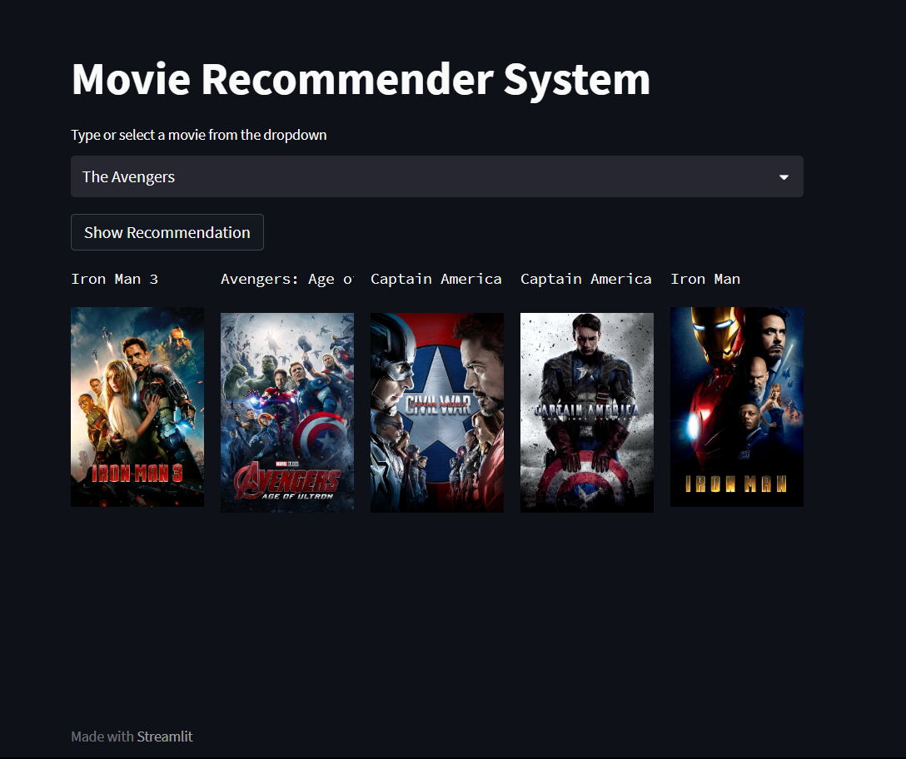

# Movie_Recommender_System

The movie recommendation system uses advanced algorithms like text vectorization (Bag of Word Algorithm) to analyse user preferences and viewing history, delivering personalised film suggestions that cater to individual tastes, enhancing the overall movie-watching experience.

### How to run 

- Download and extract the folder 
- Install Streamlit library
- First run the movie_recommender_system.ipynb file which generates the similarity matrix of size ~190MB
- Then open the terminal and type "streamlit run aoo.py"
- It will open a page in browser with this "http://localhost:8501/"

